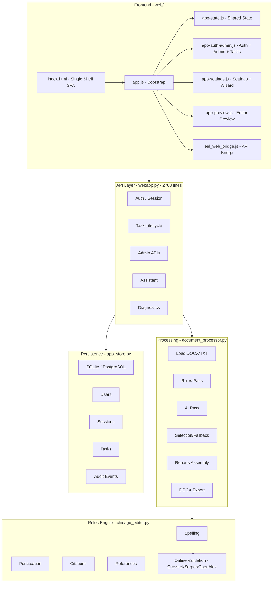
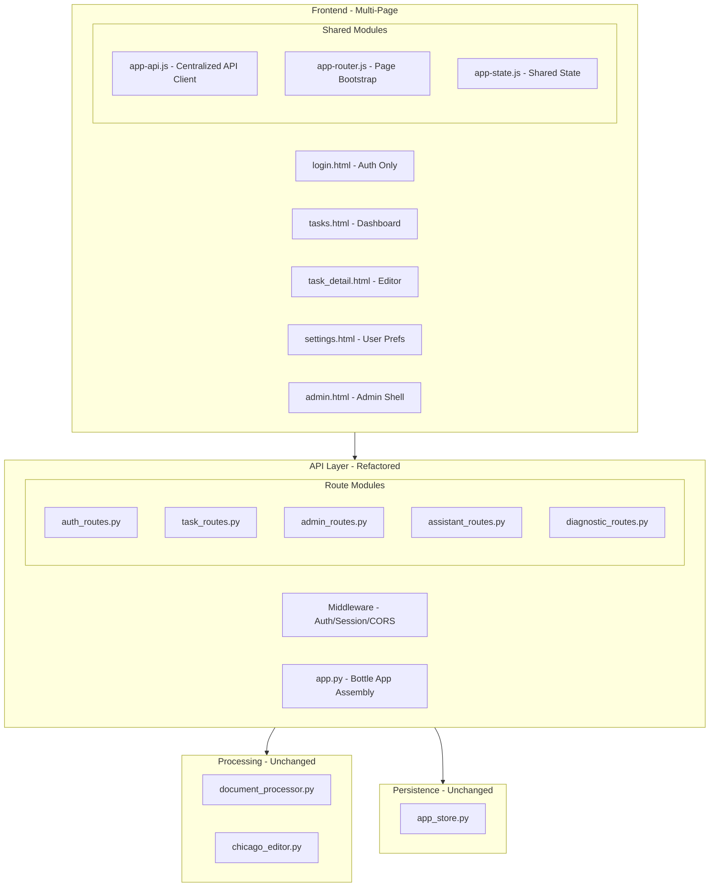
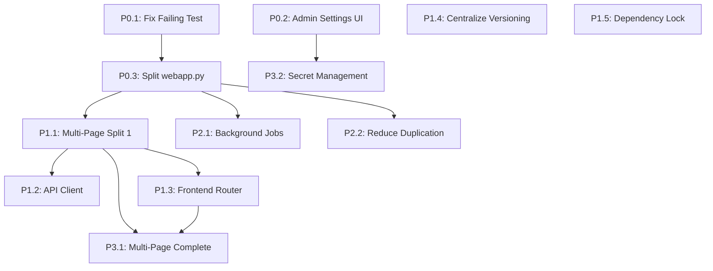

# Architecture Review & Improvement Plan

**Date**: 2026-05-13
**Project**: Manuscript Editor
**Current Stage**: Release Candidate / Engineering-Complete Core
**Review Scope**: Full-stack architecture assessment with prioritized improvements

---

## 1. Current Architecture Assessment

### 1.1 Architecture Diagram (Current State)

### 1.2 Strengths

| Area | Assessment |
|------|-----------|
| **Layered Architecture** | Clean separation: Presentation → API → Processing → Rules → Persistence |
| **Multi-Provider AI** | Ollama, Gemini, OpenRouter, AgentRouter with fallback logic |
| **Editing Pipeline** | Rules → AI → Selection/Fallback → Reports → Export is well-orchestrated |
| **Test Coverage** | 102 tests across regression, DOCX fidelity, telemetry, and API flows |
| **Deployment Ready** | Docker, Coolify, Windows installer, Ubuntu .deb, GitHub Actions CI |
| **Security Posture** | Auth guards, admin-only routes, Serper query redaction, no secret leakage in diagnostics |
| **Reference Validation** | Multi-source (Crossref → Serper → OpenAlex) with thread-safe caching through Phase 7 |
| **Documentation** | Comprehensive README, Codebase_README, status reports, roadmap, multi-page plan |

### 1.3 Critical Issues

| # | Issue | Severity | Location |
|---|-------|----------|----------|
| 1 | **Monolithic API layer** — 2703-line `webapp.py` mixes auth, tasks, admin, assistant, diagnostics, static serving | High | [`webapp.py`](webapp.py) |
| 2 | **Single-shell SPA frontend** — All UI in one HTML shell with JS-driven pseudo-routing | High | [`web/index.html`](web/index.html) |
| 3 | **Duplicated desktop/web logic** — `main.py` and `webapp.py` share overlapping processing/export paths | Medium | [`main.py`](main.py), [`webapp.py`](webapp.py) |
| 4 | **Synchronous web processing** — AI processing blocks request thread; risks timeout on large manuscripts | Medium | [`webapp.py`](webapp.py) |
| 5 | **No frontend API abstraction** — JS modules call fetch/eel bridge directly without centralized client | Medium | [`web/eel_web_bridge.js`](web/eel_web_bridge.js) |
| 6 | **Admin settings surface incomplete** — Backend flags lack UI controls | Medium | [`webapp.py`](webapp.py), [`web/app-auth-admin.js`](web/app-auth-admin.js) |
| 7 | **One failing regression test** — Assistant admin-activity response contract mismatch | Low | [`tests/test_webapp_api.py`](tests/test_webapp_api.py) |
| 8 | **Version metadata duplication** — Version scattered across docs, UI, packaging, code | Low | Multiple files |
| 9 | **No dependency lock file** — No `requirements.lock` or `constraints.txt` for deterministic builds | Low | Root |
| 10 | **Secret management** — AI provider keys stored in app settings rather than proper secrets | Low | [`webapp.py`](webapp.py) |

---

## 2. Proposed Target Architecture

### 2.1 Target Architecture Diagram

### 2.2 Key Architectural Changes

| Change | Rationale | Priority |
|--------|-----------|----------|
| **Split `webapp.py` into route modules** | Reduces monolith; each module ~300-500 lines; easier to test and maintain | P0 |
| **Implement multi-page frontend** | Already designed in [`MULTIPAGE_ARCHITECTURE.md`](MULTIPAGE_ARCHITECTURE.md); reduces DOM coupling and unused markup | P0 |
| **Create centralized API client** | Single `app-api.js` for all fetch calls; enables error handling, retry, and auth token management in one place | P1 |
| **Add frontend router** | `app-router.js` bootstraps correct page module based on `window.location.pathname` | P1 |
| **Background job queue for processing** | Moves AI processing off the request thread; enables progress polling and timeout resilience | P2 |
| **Centralize versioning** | Single source of truth (`VERSION` + `version_info.py`) drives all release surfaces | P1 |
| **Add dependency lock file** | `requirements.lock` or `constraints.txt` for deterministic builds | P1 |

---

## 3. Prioritized Improvement Plan

### Phase P0 — Stabilization & Critical Fixes

These items address the highest-risk issues and unblock further work.

#### P0.1 — Fix Failing Regression Test
- **File**: [`tests/test_webapp_api.py`](tests/test_webapp_api.py)
- **Issue**: `test_assistant_qna_admin_activity_summary_requires_admin_role` — assistant admin-activity response shape mismatch
- **Action**: Normalize assistant payload contract for admin/non-admin paths; align `admin_activity.user_counts` shape
- **Depends on**: Nothing
- **Validation**: `./scripts/run_quality_checks.sh` passes with 0 failures

#### P0.2 — Complete Admin Settings UI Controls
- **Files**: [`webapp.py`](webapp.py), [`web/app-auth-admin.js`](web/app-auth-admin.js), [`web/app-state.js`](web/app-state.js), [`web/index.html`](web/index.html)
- **Issue**: Backend flags `online_reference_validation_admin_cap` and `auto_resolve_unresolved_references` exist but have no admin UI form controls
- **Action**:
  1. Add admin UI controls (cap integer input + auto-resolve toggle)
  2. Bind load/save in `app-auth-admin.js` and `app-state.js`
  3. Add API/UI tests for round-trip persistence
- **Depends on**: Nothing
- **Validation**: Admin can view and modify both settings; values persist across reload

#### P0.3 — Split `webapp.py` into Route Modules
- **Status**: Completed initial route extraction on 2026-05-13.
- **Files**: New files under a `routes/` package
- **Issue**: 2703-line monolith is hard to navigate, test, and extend
- **Action**:
  1. [x] Create `routes/__init__.py` with Bottle app assembly
  2. [x] Extract `routes/auth_routes.py` — auth config, Google login, local login, me, logout
  3. [x] Extract `routes/task_routes.py` — task CRUD, upload, process, download, correction groups
  4. [x] Extract `routes/admin_routes.py` — users, audit, global settings, provider validation, diagnostics
  5. [x] Extract `routes/assistant_routes.py` — assistant endpoint
  6. [x] Extract `routes/diagnostic_routes.py` — health, telemetry/runtime settings
  7. [x] Extract `routes/page_routes.py` and `routes/legacy_routes.py` — HTML/static shells and compatibility APIs
  8. [x] Keep shared middleware, store access, session helpers, and processing orchestration in `webapp.py` for this safe first split
- **Depends on**: P0.1 (to ensure tests still pass after refactor)
- **Validation**: `tests.test_webapp_api` passes; full quality gate should remain the release check.
- **Follow-up**: Route modules are now separated, but `webapp.py` still owns shared helpers and app assembly. Future helper extraction can happen alongside P2/P3 work.

### Phase P1 — Frontend Modernization & Consolidation

#### P1.1 — Implement Multi-Page Frontend (Split 1: Tasks Dashboard vs Task Detail)
- **Files**: [`web/tasks.html`](web/tasks.html), [`web/task_detail.html`](web/task_detail.html) (already exist), new page modules
- **Issue**: Single-shell SPA couples all UI concerns; already designed in [`MULTIPAGE_ARCHITECTURE.md`](MULTIPAGE_ARCHITECTURE.md)
- **Action**:
  1. Add route-specific HTML renderers in backend for `/tasks` and `/tasks/<task_id>`
  2. Create `web/pages/tasks.js` — upload + task list logic
  3. Create `web/pages/task-detail.js` — editor, preview, corrections, download logic
  4. Task card click navigates to `/tasks/<task_id>` instead of inline loading
  5. Upload success redirects to new task detail page
  6. Keep `/` as compatibility redirect to `/tasks`
- **Depends on**: P0.3 (route modules make adding new routes cleaner)
- **Validation**: Task list works without loading editor shell; task detail loads one manuscript cleanly; processing/download unchanged

#### P1.2 — Create Centralized Frontend API Client
- **Files**: New `web/app-api.js`
- **Issue**: JS modules call fetch/eel bridge directly; no centralized error handling, retry, or auth
- **Action**:
  1. Create `web/app-api.js` with all fetch wrappers for task/auth/admin/runtime APIs
  2. Centralize auth token attachment, error normalization, and retry logic
  3. Migrate existing modules to use the new client incrementally
- **Depends on**: P1.1 (page modules should use the new API client from the start)
- **Validation**: All existing API calls work through the new client; error handling is consistent

#### P1.3 — Create Frontend Router
- **Files**: New `web/app-router.js`
- **Issue**: No proper client-side routing; page bootstrapping is ad-hoc
- **Action**:
  1. Create `web/app-router.js` that reads `window.location.pathname`
  2. Bootstrap the correct page module per route
  3. Handle shared state initialization (auth, session, runtime settings)
- **Depends on**: P1.1
- **Validation**: Navigating to any route loads only the correct page module

#### P1.4 — Centralize Versioning
- **Files**: [`VERSION`](VERSION), [`version_info.py`](version_info.py), packaging configs, UI footer
- **Issue**: Version duplicated across docs, UI, packaging files
- **Action**:
  1. Ensure `VERSION` + `version_info.py` is the single source of truth
  2. Update Windows installer (`.iss`), Debian build script, and UI footer to read from this source
  3. Add CI check that all version references are consistent
- **Depends on**: Nothing
- **Validation**: Changing `VERSION` updates all release surfaces

#### P1.5 — Add Dependency Lock File
- **Files**: New `requirements.lock` or `constraints.txt`
- **Issue**: No deterministic builds; dependency drift risk
- **Action**:
  1. Generate `requirements.lock` from current working dependency set
  2. Add `pip-audit` CI job for weekly vulnerability scanning
  3. Document upgrade policy
- **Depends on**: Nothing
- **Validation**: `pip install -r requirements.lock` produces identical environment

### Phase P2 — Processing Resilience & Scale

#### P2.1 — Background Job Queue for Processing
- **Files**: [`webapp.py`](webapp.py), new `job_queue.py`
- **Issue**: Synchronous AI processing blocks request thread; risks timeout on large manuscripts or slow providers
- **Action**:
  1. Implement simple in-process job queue with thread pool (or Redis/Celery for multi-worker)
  2. `POST /api/tasks/<id>/process` returns immediately with job status
  3. Frontend polls `GET /api/tasks/<id>/process-status` for progress
  4. Maintain backward compatibility for quick rule-only processing
- **Depends on**: P0.3 (cleaner route structure)
- **Validation**: Large manuscript processing doesn't block other requests; progress updates visible in UI

#### P2.2 — Reduce Desktop/Web Duplication
- **Files**: [`main.py`](main.py), [`webapp.py`](webapp.py), [`web/eel_web_bridge.js`](web/eel_web_bridge.js)
- **Issue**: Overlapping processing/export logic between desktop and web paths
- **Action**:
  1. Extract shared processing orchestration into `document_processor.py` (largely already done)
  2. Create shared export helpers usable by both runtimes
  3. Deprecate or isolate Eel-specific code paths
- **Depends on**: P0.3
- **Validation**: Both desktop and web modes use identical processing/export code paths

### Phase P3 — Multi-Page Completion & Admin Separation

#### P3.1 — Complete Multi-Page Split (Admin + Settings)
- **Files**: New `web/admin.html`, `web/settings.html`, page modules
- **Issue**: Admin and settings still coupled to editor shell
- **Action**:
  1. Move admin to `/admin/runtime`, `/admin/users`, `/admin/audit`
  2. Move setup/provider UI to `/settings`
  3. Decompose `app-auth-admin.js` into focused page modules
- **Depends on**: P1.1, P1.3
- **Validation**: Admin pages load without editor markup; settings page is standalone

#### P3.2 — Secret Management Hardening
- **Files**: [`webapp.py`](webapp.py), deployment docs
- **Issue**: AI provider keys stored in app settings; should use environment secrets
- **Action**:
  1. Support reading provider keys from environment variables as primary source
  2. App settings UI becomes override-only with clear "use server-configured key" default
  3. Document secret management for each deployment target (Docker, Coolify, desktop)
- **Depends on**: P0.2
- **Validation**: Provider keys can be set via env vars; UI shows whether server key or custom key is active

---

## 4. Dependency Graph

---

## 5. Risk Assessment

| Risk | Likelihood | Impact | Mitigation |
|------|-----------|--------|------------|
| Route module split breaks API contracts | Medium | High | Run full test suite after each extraction; keep old `webapp.py` as fallback during transition |
| Multi-page frontend breaks existing workflows | Medium | Medium | Implement incrementally; keep compatibility redirects; test each page independently |
| Background job queue introduces concurrency bugs | Low | Medium | Start with simple thread-pool; thorough testing with concurrent requests |
| Dependency lock breaks on different platforms | Low | Low | Test on both Linux and Windows; use platform-conditional dependencies |

---

## 6. Success Metrics

| Metric | Current | Target |
|--------|---------|--------|
| `webapp.py` line count | 2703 | <500 (orchestration only) |
| Frontend HTML shells | 1 (index.html) | 5 (login, tasks, task_detail, settings, admin) |
| Failing tests | 1 | 0 |
| API client locations | Scattered across 5+ JS files | 1 (`app-api.js`) |
| Version sources | 5+ files | 1 (`VERSION`) |
| Admin settings with UI controls | ~80% | 100% |
| Synchronous processing endpoints | 1 (blocks) | 0 (all async with polling) |

---

## 7. Recommended Execution Order

1. **P0.1** → Fix the failing test (unblocks everything)
2. **P0.2** → Complete admin settings UI (quick win, standalone)
3. **P0.3** → Split `webapp.py` into route modules (foundational for all P1/P2 work)
4. **P1.4 + P1.5** → Versioning + dependency lock (standalone, quick wins)
5. **P1.1** → Multi-page Split 1: Tasks Dashboard vs Task Detail
6. **P1.2 + P1.3** → API client + frontend router (enables clean P3)
7. **P2.1** → Background job queue (resilience)
8. **P2.2** → Reduce desktop/web duplication
9. **P3.1** → Complete multi-page split
10. **P3.2** → Secret management hardening
